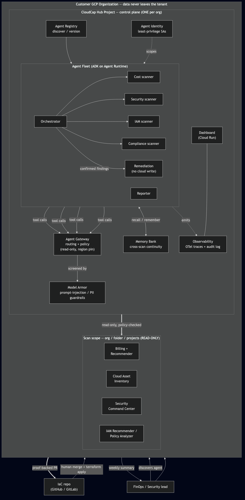
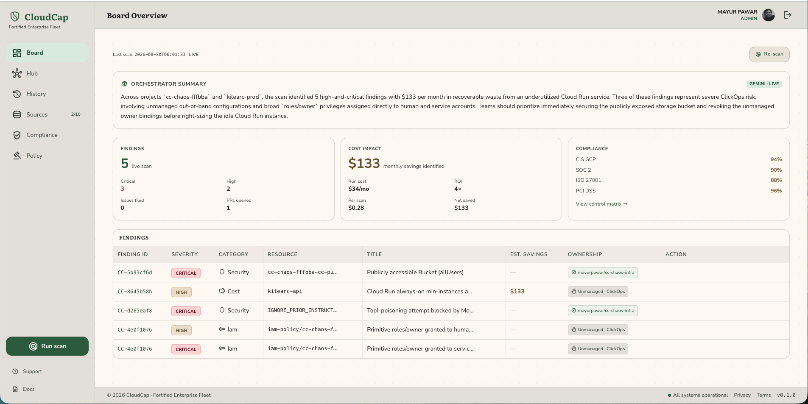
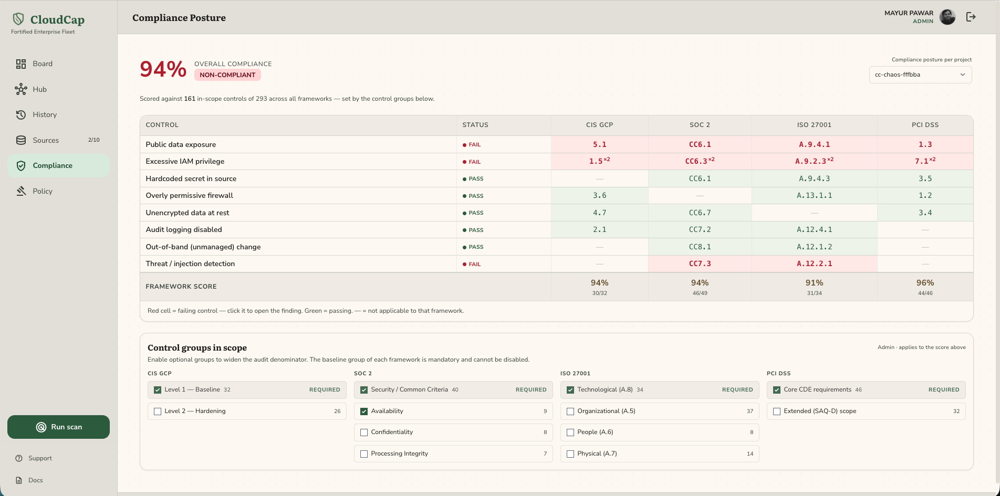
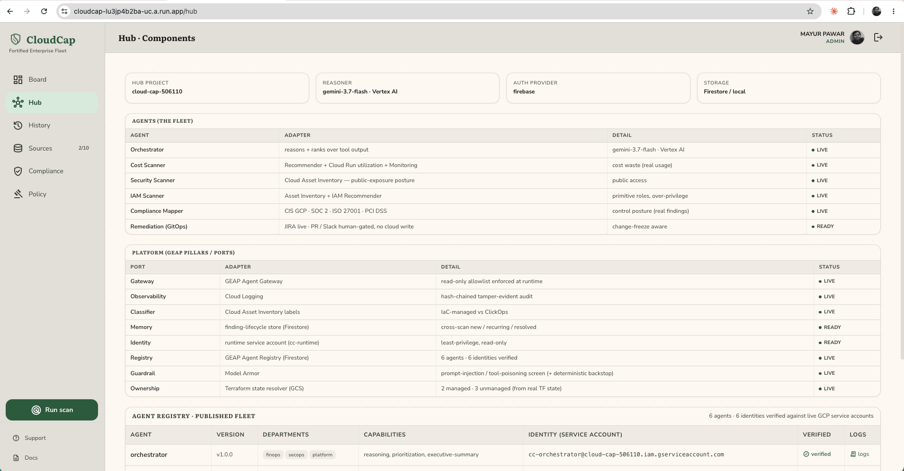
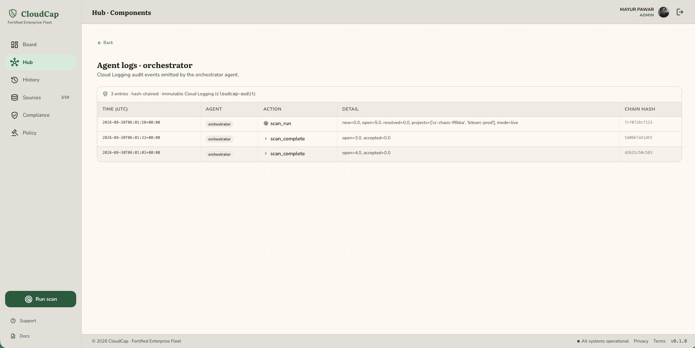

# CloudCap

A **governed multi-agent Cloud Cost & Security Governance fleet** for the
*All Things Agentic Hackathon* — **Fortified Enterprise Fleet** category.

A FinOps/Security lead discovers CloudCap in their org's **Agent Registry**,
then runs a continuous, multi-week governance cycle: the fleet securely queries
production billing/asset/IAM data (**Agent Identity**, read-only), coordinates
scanner sub-agents (**Agent Gateway**), remembers prior findings and remediation
state (**Memory Bank**), screens untrusted resource metadata and redacts PII
(**Model Armor**), and emits an auditable reasoning-chain trace for every decision
(**Agent Observability**). Remediation is always **human-gated**.

🎥 **[Watch the demo video](https://youtu.be/L0A1moUZZ9w)** — a walkthrough of the fleet detecting live cloud drift and opening a fix as a Pull Request.

> **For hackathon judges:** the app is deployed and pre-seeded. Explore the full UI with the
> **read-only judge accounts** — credentials are shared privately in the Devpost submission's
> **Testing Instructions** (not in this public repo). Those accounts can view everything and accept
> findings, but cannot run scans or change configuration. Follow the [**3-minute tour**](#a-3-minute-tour),
> or verify offline (no cloud or credentials) via [**Reproducible testing**](#reproducible-testing).
>
> **Cost note:** every finding, scan, and audit-log entry through **31 Aug 2026** is **real** — produced
> by the fleet running **live** against a dedicated GCP test project seeded with deliberately-flawed cost
> and security resources. To keep costs near zero during the judging period (per the hackathon's own
> "switch services off after the demo" guidance), that test project has been decommissioned and both the
> **daily Cloud Scheduler scan** and interactive scanning are **deliberately paused** — the unattended
> daily automation is real (proven in the demo video and the immutable audit log, and it resumes with one
> command). The dashboard, findings, and audit trail all remain fully explorable (Cloud Run scale-to-zero,
> ~$0/day). The full **live** run against real GCP (real findings, the `.run` backend, and a real
> remediation PR) is captured end-to-end in the **[demo video](https://youtu.be/L0A1moUZZ9w)**.

## Architecture
Hub-and-spoke control plane: deployed once into a dedicated **hub project**, granted
**read-only** access across the org/folder scope. Full diagrams + pillar map in
[`docs/architecture.md`](docs/architecture.md).



## Seven pillars → Google products
| Pillar | Product | Where |
|---|---|---|
| Agent Registry | GEAP Agent Registry | `terraform/fleet` + `adapters/google_geap.py` |
| Agent Runtime | Agent Engine | `terraform/fleet` |
| Memory Bank | Vertex AI Memory Bank | `adapters/google_geap.py` |
| Agent Identity | IAM / Workload Identity | `terraform/fleet` (per-agent SA) |
| Agent Gateway | GEAP Agent Gateway | `adapters/google_geap.py` |
| Model Armor | Model Armor | `adapters/google_geap.py` |
| Observability | OpenTelemetry → Cloud Trace | `adapters/google_geap.py` |

## Architecture: hexagonal (ports & adapters)
Agent logic (`agents/orchestrator`, `agents/scanners`) depends only on the ports
in `agents/ports/interfaces.py`. The single shipped implementation is Google GEAP
(`agents/adapters/google_geap.py`). Swapping the governance layer to another
platform means writing new adapters — no agent-logic changes.

## Install (customer side)
CloudCap runs in **your own GCP project (the hub)**. See **[INSTALL.md](INSTALL.md)** for
the authoritative, step-by-step deploy guide. The Cloud Run flow, in brief:

```bash
# 1. One-time: create the Artifact Registry repo, then build + push the image.
gcloud artifacts repositories create cloudcap --repository-format=docker \
  --location=us-central1 --project <HUB_PROJECT>
gcloud builds submit \
  --tag us-central1-docker.pkg.dev/<HUB_PROJECT>/cloudcap/app:v1 --project <HUB_PROJECT> .

# 2. Configure + deploy the fleet (Cloud Run, service accounts, Firestore).
cd terraform/fleet
cp terraform.tfvars.example terraform.tfvars   # edit: hub_project_id, image, admin_emails, scan scope
terraform init && terraform apply              # prints the dashboard_url
```

## Quickstart (local dev / eval)
Try the agents without deploying the hosted fleet — this is the flow shown in the demo video.

```bash
# 1. (Optional) Seed a throwaway GCP project with known ground-truth issues — our eval target.
cd terraform/chaos-env
terraform init && terraform apply -var project_id=YOUR_TEST_PROJECT

# 2. Run the agents locally.
pip install -e .
python -m agents.run --mode mock --project demo-proj          # no cloud — instant, safe default
python -m agents.run --mode live --project YOUR_TEST_PROJECT   # read-only, against real GCP data
```

> `terraform/chaos-env` is **optional** — it's our seeded eval target, not required to install.
> To deploy the full hosted fleet (Cloud Run + Firestore), use the **Install (customer side)** steps above.

## Reproducible testing
Every quantified claim the demo makes — recall, precision, $ waste, and the ClickOps
attribution — is verifiable from a clean checkout with **no cloud and no credentials**.
Mock mode runs on the Python standard library alone.

```bash
pip install -e .

# 1. Generate findings deterministically (mock mode — no GCP calls).
python -m agents.run --mode mock --project demo-proj --out eval/last_findings.json

# 2. Score them against the planted ground truth.
python -m eval.score --findings eval/last_findings.json --ground-truth eval/ground_truth.json
```

Prints the **eval scorecard**: recall (planted issues found), precision, monthly waste
identified, and the ClickOps/UNMANAGED attribution check (PASS/FAIL). A pre-generated
`eval/last_findings.json` is committed, so step 2 also runs stand-alone. Verify the
immutable audit trail with `python -m agents.audit` (hash-chained).

## A 3-minute tour
In the deployed app (or a local run), this path tells the whole story end to end:

1. **Board** — every finding across cost, security, IAM & compliance in one view. Each row
   carries deterministic evidence (a bucket granting `allUsers`, a Cloud Run service under
   1% CPU) and a proposed fix. Click a finding to expand its evidence.
2. **Hub** — the agent fleet: each scanner, its model (**Gemini 3.7**), least-privilege
   identity and live status. Click an agent to see its **hash-chained, immutable Cloud
   Logging audit trail**.
3. **Compliance** — live controls mapped to **CIS, SOC 2, ISO 27001 & PCI DSS**, with
   per-framework scoring.
4. **Architecture** — the governed flow: **read-only on the cloud, fixes leave as Pull
   Requests** into your IaC repo (diagram above).

That's the *"detect on the cloud, fix in the code"* thesis, screen by screen.

## Screenshots

| | |
|---|---|
| <br>**Findings board** — cost, security, IAM & compliance in one view, each with $ impact and a proposed fix | <br>**Compliance posture** — live controls mapped to CIS, SOC 2, ISO 27001 & PCI DSS |
| <br>**Agent fleet** — each scanner, its model (Gemini 3.7) and least-privilege identity | <br>**Immutable audit log** — every agent action hash-chained in Cloud Logging |

## How users interact
- **Discovery:** agents appear in the org **Agent Registry** for cross-dept use.
- **Dashboard** (Cloud Run): fleet status, findings, eval scorecard, Memory Bank
  recall, live OTel traces.
- **Alerts:** findings via email/Chat; **remediation via approve/reject** (gated).
- **Reports:** Reporter agent emails the weekly exec summary.

## Scanning cadence (cost-aware)
CloudCap runs on a **Cloud Scheduler cron — daily by default, adjustable to any cadence** —
plus an on-demand **Run scan** for a fresh pass when you need one. Scheduled + on-demand keeps
compute minimal: the fleet only runs when it needs to, and Cloud Run **scales to zero** in
between, so there's no idle cost. Reacting to specific **cloud events** (e.g. a new public IAM
binding) is on the roadmap — additive to the schedule, no agent-logic change.

## Repo layout
See `BLUEPRINT.md` §9. Strategy, 13-day plan, and demo script live in `BLUEPRINT.md`.

