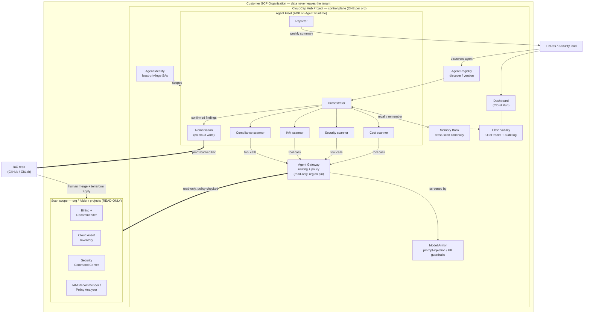

# CloudCap — Architecture

CloudCap is a **hub-and-spoke governance control plane** built on the Gemini Enterprise
Agent Platform. It deploys once into a dedicated **hub project**, is granted **read-only**
access across the org/folder scope, detects cost + security + IAM issues (including
untracked ClickOps resources), and delivers every fix as a **human-approved GitOps PR** —
the agents hold **zero cloud write access**.

## 1. System & deployment topology (hub-and-spoke + the seven pillars)

## 2. Scan → remediation lifecycle

```mermaid
flowchart LR
  A["1. Discover<br/>agent in Registry"] --> B["2. Scan read-only<br/>via Gateway → GCP APIs"]
  B --> C["3. Guardrail<br/>Model Armor screens<br/>untrusted metadata"]
  C --> D["4. Classify<br/>mgmt source + attribution<br/>ClickOps → real actor"]
  D --> E["5. Dedup<br/>Memory Bank recall<br/>suppress already-known"]
  E --> F["6. Prove<br/>deterministic evidence<br/>not AI prose"]
  F --> G["7. Remediate<br/>GitOps PR: managed diff /<br/>codify-then-PR for ClickOps"]
  G --> H["8. Policy gate +<br/>human approve / merge"]
  H --> I["9. Observe<br/>OTel trace + audit log"]
```

## 3. Pillar → product → code map

| GEAP pillar | Google product | Port (interface) | Adapter |
|---|---|---|---|
| Agent Registry | GEAP Agent Registry | `RegistryPort` | `AgentRegistryAdapter` |
| Agent Runtime | Agent Engine | (deploy) | `terraform/fleet` |
| Memory Bank | Vertex AI Memory Bank | `MemoryPort` | `MemoryBankAdapter` / `FileBackedMemory` |
| Agent Identity | IAM / Workload Identity | `IdentityPort` | `WorkloadIdentityAdapter` |
| Agent Gateway | GEAP Agent Gateway | `GatewayPort` | `AgentGatewayAdapter` |
| Model Armor | Model Armor | `GuardrailPort` | `ModelArmorAdapter` |
| Observability | OpenTelemetry → Cloud Trace | `ObservabilityPort` | `OtelObservabilityAdapter` |
| — Remediation | GitHub/GitLab PR | `RemediationChannelPort` | `PullRequestChannel` |
| — Classification | Asset Inventory + Audit Logs | `ResourceClassifierPort` | `AuditLogClassifierAdapter` |

Agent logic depends only on the ports (`agents/ports/interfaces.py`); Google is one
implementation set (`agents/adapters/google_geap.py`), the runnable mock is another
(`agents/adapters/local_mock.py`) — the hexagonal seam that keeps the fleet portable.

## 4. Trust model (why it's safe for production)
- **Read-only scanners** — least-privilege SAs granted at the org/folder node.
- **No cloud write, ever** — remediation is a GitOps PR; merging (not the AI) changes infra.
- **Deterministic proof** attached to every PR; the LLM explains evidence, never asserts it.
- **Semantic policy gate** evaluates each PR before a human sees it.
- **Quarantine-first** decommission (reversible: stop+snapshot / strip-public-IAM), never raw delete.
- **Model Armor** blocks prompt-injection / tool-poisoning from untrusted resource metadata.
- **Full OTel audit trail** for every reasoning step.

## 5. Deployment model, ICP & multi-cloud roadmap

**GCP-native, always.** The control plane deploys into a GCP hub project and leverages
the Gemini Enterprise Agent Platform (Registry, Runtime, Memory Bank, Gateway, Model
Armor). This is the moat and does not change — other clouds are *audited*, never the
deployment target.

**Ideal customer profile:** organizations that have GCP — GCP-native, or multi-cloud
that includes GCP. The strongest wedge is **multi-cloud unified governance**: native
single-cloud tools each see only their own cloud, so nobody gives a multi-cloud org one
governance + compliance posture across GCP + AWS + Azure. CloudCap-on-GCP is that unified
control plane (one board, one SOC2/PCI evidence pack, one remediation workflow).

**Not the near-term ICP:** AWS-only / Azure-only shops (native tools suffice; they won't
stand up GCP). Optional future paths: a small dedicated GCP "governance project" as the
brain (~$37/mo, ROI-positive), or a hosted SaaS.

**What's next — AWS & Azure (roadmap):** new clouds are *adapter packs behind the same
ports*, not a rewrite. ~70–80% is cloud-agnostic and reused (findings, lifecycle,
suppression/exceptions, **IaC ownership via Terraform state**, GitOps remediation,
compliance mapping, dashboard, RBAC). Per-cloud swaps: data-source scanners
(AWS Cost Explorer/Config/Security Hub/CloudTrail; Azure Cost Mgmt/Resource Graph/
Defender/Activity Log), attribution source, remediation templates, and CIS benchmark IDs.
The two differentiators — **IaC-ownership + GitOps remediation** — are already cross-cloud
because Terraform state is provider-agnostic.
